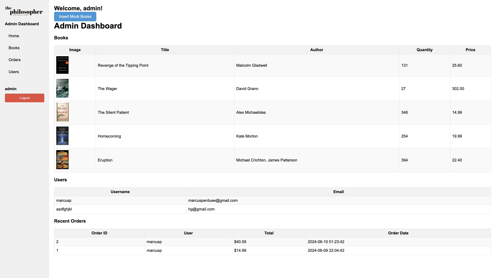

# The Philosopher

## Description
Welcome to The Philosopher project! This project aims to provide a platform for book lovers to explore, discover, and purchase their favorite books online.

## Features

- **User Authentication**: Users can securely log in, sign up, and log out.
- **Admin Panel**: Administrators have access to an admin panel where they can:
  - Add new books to the inventory
  - Delete existing books from the inventory
  - Edit user information
  - View and manage orders
- **Book Categories**: Explore books across various genres such as Fiction, Mystery, Thriller, Non-Fiction, Romance, and more.
- **Search**: Easily find specific books using the search functionality.
- **Book Details**: View detailed information about each book including title, author, description, genre, price, and quantity available.
- **Add to Cart**: Add books to the shopping cart for easy checkout.
- **Favorites**: Save favorite books for future reference.
- **Responsive Design**: The website is optimized for various devices including desktops, tablets, and smartphones.
- **Checkout**: A smooth and secure checkout process.
- **Order Summary**: View order details before finalizing the purchase.
- **Privacy Policy**: Detailed privacy policy modal for user consent.
- **FAQ Page**: Comprehensive FAQ section addressing common queries.

## Technologies Used

- HTML5
- CSS3
- JavaScript (ES6+)
- PHP
- MySQL

## Installation

- **Update Database Connection:**
    - Open the `connect.php` file and update it with your database credentials (hostname, database name, username, password).

- **Install Dependencies:**
    - Ensure you have PHP and a web server (like Apache) installed.
    - Place the project in your web server's root directory.
- **Run the Application:**
    - Start your web server and navigate to `http://localhost/final/client` and `http://localhost/final/admin` in your browser.
    - Run the page `http://localhost/final/client/connect.php` to load all tables.

## Usage

1. **User Authentication:**
    - Navigate to the login or sign-up page to create an account or log in.
    
2. **Browsing Books:**
    - Use the search bar or categories to find books.
    
3. **Admin Panel:**
    - Log in with an admin account to access the admin panel and manage the site.
    - **Admin Credentials:**
      - Username: `Admin`
      - Password: `12345678`

## Common Issues and Solutions

- **Cannot Connect to Database:**
  - Ensure your `connect.php` file has the correct database credentials.
  - Check if your MySQL server is running.
  - Run the page `http://localhost/final/client/connect.php` to load all tables.

- **CSS/JS Not Loading:**
  - Verify that your file paths are correct.
  - Ensure your web server has permissions to read the files.

- **Form Validation Errors:**
  - Ensure all required fields are filled out correctly.

- **Favorites and Checkout Not Working:**
  - You need an account and to be signed in.

## Support

- For any issues or questions, please reach out to our [support team](mailto:support@philosopherbooks.com).

## Contributing

Contributions are welcome! Please follow the [contribution guidelines](CONTRIBUTING.md) to contribute to this project.

## License

This project is licensed under the MIT License - see the [LICENSE](LICENSE) file for details.

## Modules and Functions Documentation

- **User Authentication Module:**
  - `login.php`: Handles user login, logout, and registration.
 

- **Admin Panel Module:**
  - `admin_login.php`: Admin login functionality.
  - `sidebar.php`: Admin dashboard overview.
  - `books.php`: Add, edit, and delete books.
  - `users.php`: Edit and delete users.
  - `orders.php`: View and manage orders.

- **Cart and Checkout Module:**
  - `cart.php`: Displays the user's cart.
  - `checkout.php`: Handles the checkout process.
  - `order_success.php`: Displays order success message.

- **Utilities:**
  - `connect.php`: Database connection setup.

## Google Maps Integration

- **Store Locator:** Display store locations on a map using the Google Maps API.

## Screenshots

### Home Page

### Admin Dashboard

